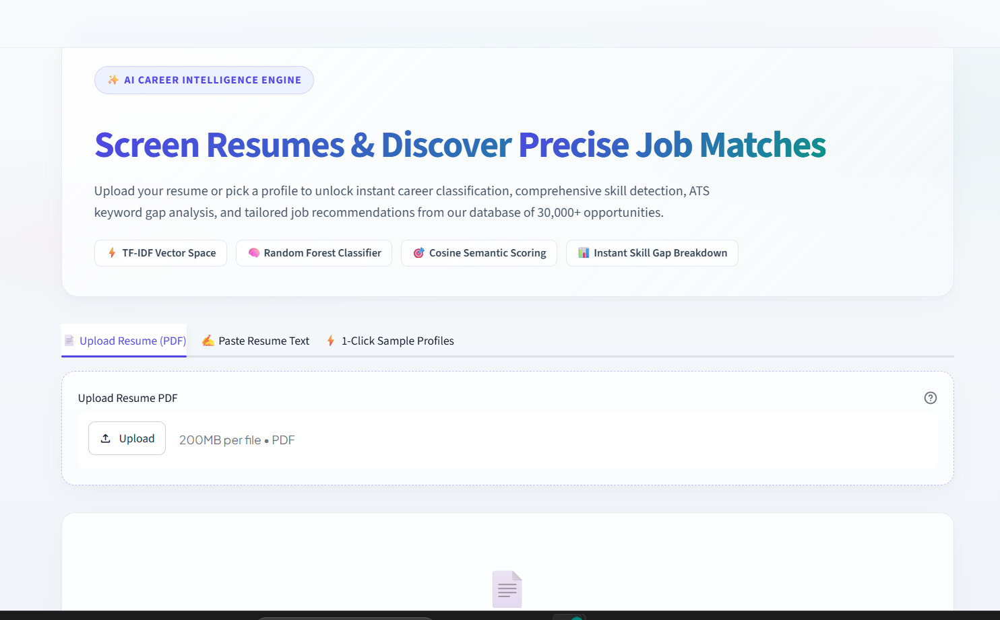
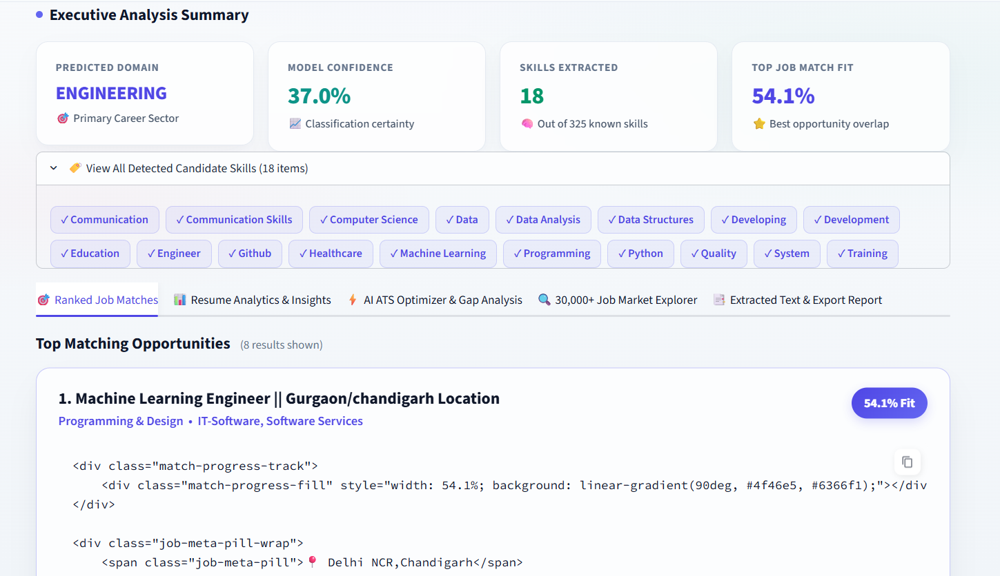
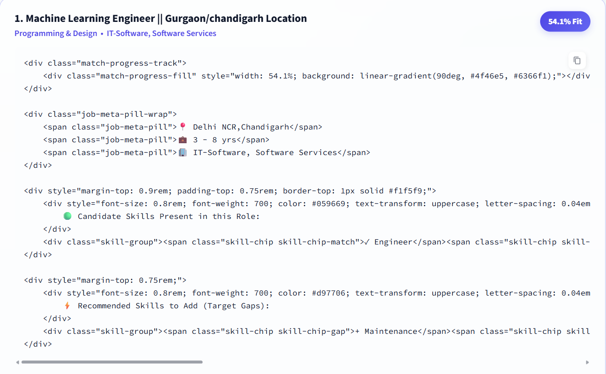
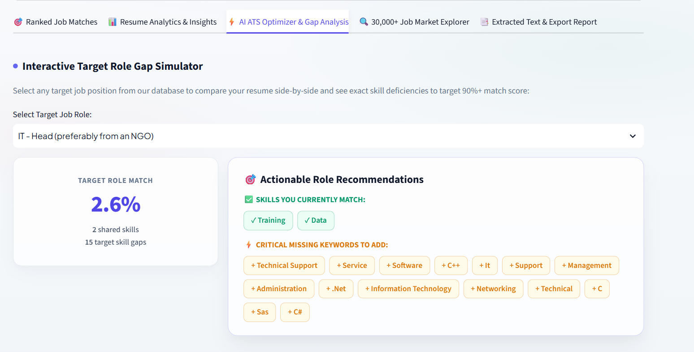

# 🤖 TalentPulse AI — Resume Intelligence & Job Matching

AI-powered resume analysis and job matching system built with Python, Machine Learning and Streamlit.

TalentPulse AI analyzes a user's resume, predicts a suitable career domain, identifies skills, checks ATS-related resume factors and recommends relevant job opportunities based on resume-job similarity.

---

## 🎯 What is TalentPulse AI?

Finding the right job is not always easy. A resume may contain good skills and experience, but it can still be difficult to understand:

- Which career domain fits the resume?
- Which skills are already present?
- Which skills are missing for a particular role?
- How closely does the resume match available jobs?
- Is the resume optimized for automated screening systems?

TalentPulse AI brings these tasks together in one web application.

---

## ✨ Features

### 📄 Resume Analysis
- Upload a PDF resume
- Paste resume text
- Select a sample profile
- Extract selectable PDF text automatically

### 🧠 Career Domain Prediction
A trained Random Forest classifier predicts the career category that best matches the resume.

- 24 career categories
- 200 decision trees

### 🏷️ Skill Detection
The system checks resumes against a predefined taxonomy of **325 recognized skills**.

### 🎯 Job Matching
Resume and job descriptions are compared using **TF-IDF + Cosine Similarity**.

Users can control:
- Number of job matches
- Minimum match score
- Location
- Industry

### ⚡ ATS Optimization
The ATS module checks:
- Quantifiable achievements
- Action-oriented language
- Keyword coverage
- Standard ATS headings

### 📊 Resume Analytics
Displays:
- Predicted career domain
- Model confidence
- Detected skills
- Top job match
- Career probability distribution
- Word and character count
- Skill density
- Average word length

### 🔍 Job Market Explorer
Explore a database containing **30,000+ job opportunities** using job title, skills, location and industry.

### 📥 Report Export
Download:
- Resume analysis report
- Top job matches as CSV

---

# 🧠 Machine Learning Pipeline

```text
                 Resume
                   │
                   ▼
          ┌─────────────────┐
          │ Text Extraction │
          │     PyPDF2      │
          └────────┬────────┘
                   │
                   ▼
          ┌─────────────────┐
          │  Resume Text    │
          └────────┬────────┘
                   │
          ┌────────┴────────┐
          │                 │
          ▼                 ▼
   ┌──────────────┐   ┌───────────────┐
   │ TF-IDF       │   │ Skill         │
   │ Vectorizer   │   │ Detection     │
   └──────┬───────┘   └───────┬───────┘
          │                   │
          ▼                   ▼
   ┌──────────────┐    Detected Skills
   │ Random Forest│
   │ Classifier   │
   └──────┬───────┘
          │
          ▼
    Career Category
          │
          ▼
   ┌─────────────────────┐
   │ Job Matching Engine │
   │ TF-IDF + Cosine     │
   │ Similarity          │
   └──────────┬──────────┘
              │
              ▼
       Ranked Job Matches
              │
              ▼
       Skill Gap Analysis
```

---

# 🤖 Machine Learning Models

## Random Forest Classifier

| Parameter | Value |
|---|---:|
| Algorithm | Random Forest |
| Number of Trees | 200 |
| Career Categories | 24 |

## TF-IDF Vectorization

| Vectorizer | Features | Purpose |
|---|---:|---|
| Resume TF-IDF | 5,000 | Career classification |
| Job Matching TF-IDF | 15,000 | Resume-job matching |

Both use unigram and bigram features.

## Cosine Similarity

The resume and job descriptions are converted into TF-IDF vectors and cosine similarity is used to rank jobs.

> The job-match percentage is a similarity score, not a probability of getting hired.

---

# 🏷️ Skill Extraction

The application contains a predefined taxonomy of **325 skills**.

The resume is checked against these skills using case-insensitive whole-word/phrase matching.

For a selected job:

```text
Candidate Skills
       │
       ├── Matching Skills
       │
       └── Missing Skills
```

This helps users understand which skills they already have and which skills they may need to develop.

---

# ⚡ ATS Optimization

The ATS section works as a resume improvement assistant.

### Quantifiable Impact
Checks whether the resume contains numerical information that can demonstrate measurable results.

### Action-Oriented Language
Recommends stronger action-oriented verbs for experience descriptions.

### Keyword Coverage
Uses recognized technical skills as one indicator of keyword coverage.

### Standard ATS Headings
Recommends headings such as:
- Professional Experience
- Technical Skills
- Education
- Summary

---

# 📊 Job Database

TalentPulse AI uses a job database containing **30,000+ job records**.

| Field | Description |
|---|---|
| Job Title | Position name |
| Experience | Required experience |
| Key Skills | Required skills |
| Location | Job location |
| Industry | Industry |
| Role Category | Job category |
| Role | Specific role |
| Job Text | Original job description |
| Cleaned Job Text | Processed job description |
| Extracted Skills | Skills extracted from job |

---

# 🏗️ Application Architecture

```text
┌───────────────────────────────────────────────┐
│                  Streamlit UI                 │
│  Resume Upload / Text / Sample Profile        │
└───────────────────────┬───────────────────────┘
                        │
                        ▼
┌───────────────────────────────────────────────┐
│             Resume Processing                 │
│                 PDF → Text                    │
└───────────────────────┬───────────────────────┘
                        │
             ┌──────────┴──────────┐
             │                     │
             ▼                     ▼
     ┌───────────────┐     ┌───────────────┐
     │ Classification│     │ Skill Detection│
     │ Random Forest │     │ 325 Skills     │
     └───────┬───────┘     └───────┬───────┘
             │                     │
             └──────────┬──────────┘
                        │
                        ▼
             ┌────────────────────┐
             │ Job Matching Engine│
             │ TF-IDF + Cosine    │
             └─────────┬──────────┘
                       │
                       ▼
             ┌────────────────────┐
             │ Ranked Opportunities│
             └─────────┬──────────┘
                       │
             ┌─────────┴──────────┐
             ▼                    ▼
       Skill Gap Analysis     ATS Suggestions
```

---

# 📁 Project Structure

```text
TalentPulse-AI/
│
├── app.py
├── README.md
├── requirements.txt
├── .gitignore
│
├── models/
│   ├── resume_classifier.pkl
│   ├── resume_tfidf.pkl
│   ├── job_matching_tfidf.pkl
│   └── skill_list.pkl
│
├── data/
│   └── jobs_data.pkl
│
└── screenshots/
    ├── home.png
    ├── analytics.png
    ├── job-matches.png
    └── ats-optimizer.png
```

---

# 🛠️ Tech Stack

| Category | Technology |
|---|---|
| Programming Language | Python |
| Web Framework | Streamlit |
| Machine Learning | Scikit-learn |
| Data Processing | Pandas, NumPy |
| Text Processing | TF-IDF |
| Classification | Random Forest |
| Similarity | Cosine Similarity |
| PDF Processing | PyPDF2 |
| Model Storage | Joblib |
| Visualization | Plotly |
| UI | HTML + CSS + Streamlit |

---

 🚀 Installation

## Prerequisites

- Python 3.9+
- Git
- pip

## Clone the Repository

```bash
git clone https://github.com/YOUR-USERNAME/TalentPulse-AI.git
cd TalentPulse-AI
```

## Create Virtual Environment

### Windows

```bash
python -m venv venv
venv\Scripts\activate
```

### Mac/Linux

```bash
python3 -m venv venv
source venv/bin/activate
```

## Install Dependencies

```bash
pip install -r requirements.txt
```

## Run the Application

```bash
streamlit run app.py
```

---

# 🎮 How to Use

1. Open TalentPulse AI.
2. Upload a resume PDF or paste resume text.
3. Check the predicted career domain and detected skills.
4. Open **Ranked Job Matches** to see recommended jobs.
5. Open **Resume Analytics** to view resume statistics.
6. Open **ATS Optimizer & Gap Analysis** to compare the resume with a target job.
7. Use **Job Market Explorer** to search available jobs.
8. Download the analysis report or job-match CSV.

---

# 📸 Screenshots

Replace these image paths with your actual screenshots after uploading them to the `screenshots/` folder.

## 🏠 Home Dashboard




## 📊 Resume Analytics



## 🎯 Job Matches




## ⚡ ATS Optimizer



---

# 📈 Project Highlights

| Component | Details |
|---|---|
| Career Categories | 24 |
| Recognized Skills | 325 |
| Indexed Jobs | 30,000+ |
| Random Forest Trees | 200 |
| Resume TF-IDF Features | 5,000 |
| Job Matching TF-IDF Features | 15,000 |

---

# 🔮 Future Improvements

- Transformer-based semantic embeddings
- Better synonym detection
- Larger skill taxonomy
- OCR support for scanned resumes
- Real-time job APIs
- Personalized learning recommendations
- Improved ATS scoring
- Resume section quality analysis
- Job recommendation explanations
- Model evaluation dashboard
- Precomputed job vectors for faster matching

---

# ⚠️ Limitations

- PDF extraction works best with selectable text.
- Scanned/image-only resumes are not supported by the current PDF extraction pipeline.
- Skill detection depends on the predefined 325-skill taxonomy.
- TF-IDF matching is mainly based on textual similarity and may miss some semantic relationships.
- Job-match scores are similarity scores and are not hiring probabilities.
- Career predictions are limited to categories available in the trained model.

---

# 📚 Learning Outcomes

This project demonstrates practical implementation of:

- Natural Language Processing
- Text preprocessing
- TF-IDF vectorization
- Supervised Machine Learning
- Random Forest classification
- Cosine similarity
- Information extraction
- Skill-gap analysis
- Data visualization
- Streamlit application development
- Model serialization with Joblib
- Interactive dashboard development

---

# 👩‍💻 Author

**Your Name**

B.Tech – Computer Science & Engineering

**Interests:** Machine Learning • Artificial Intelligence • Python • Data Science

---

# 📄 License

This project is created for educational and learning purposes.

---

## ⭐ Support

If you find this project useful, consider giving the repository a ⭐.
